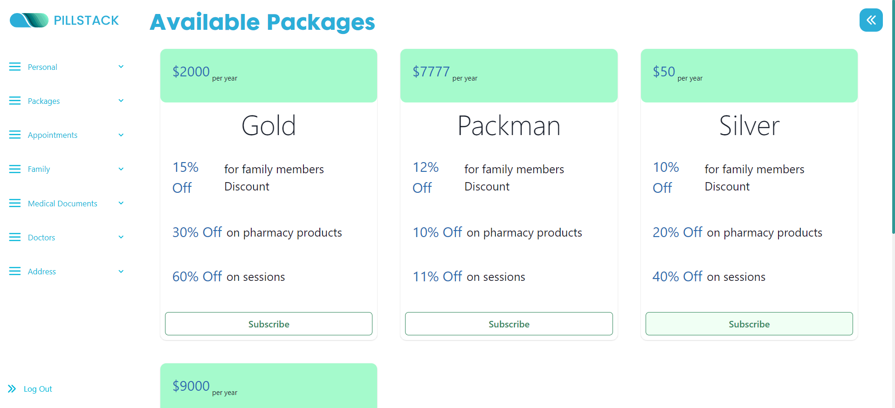
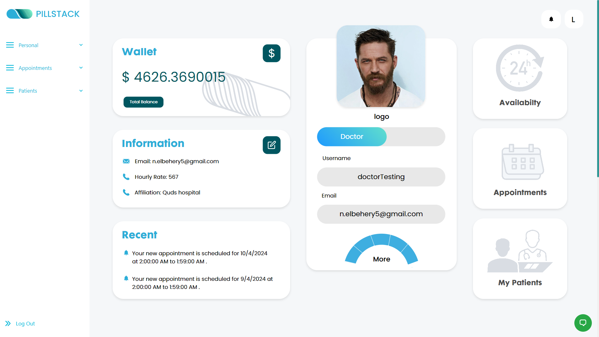
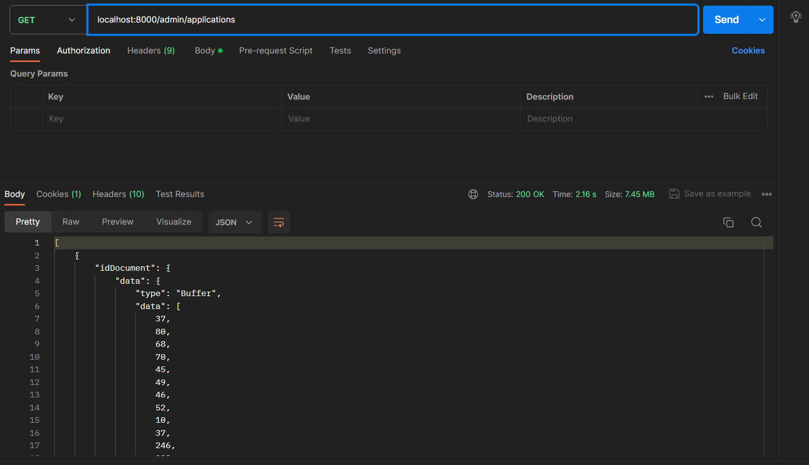

PillStack is a virtual clinic platform coupled with an online pharmacy. This MERN stack project aims to eradicate the challenges associated with physical hospital visits by providing a complete digital healthcare solution.

# Motivation

This project serves as a learning opportunity to collaborate effectively within a team setting, specifically focusing on the development of a MERN Stack project. The primary objectives include gaining practical experience in meeting both Functional and Non-Functional Requirements, navigating diverse APIs, and cultivating a consistent coding style.
# Build Status
- The system currently does not allow the user to top up their wallet balance. However in the future we intend to add this feature.
- The system does not verify the user's email upon registeration.
- For reporting bugs or offering contributions or enhancements please check our Contributions section below.  

# Screenshots
- Landing Page

- Login Page

- Patient home page

- View all doctors on the platform

- Book an appointment
 
- chat with a doctor 

- Add a family member
 
- View linked family members
 
- View my appointments 

- View my family's appointments
 
- View my health packages

- Subscribe to a health package

- Doctor's home page 

- View doctor's patients 
 
- chat with a patient

- Add an appoinmment to my bookings

- Accept/Reject a follow up requested by a patient
- Schedule a follow up for a patient

- Admin home page

- Add a new admin to the system
  
- Delete a user from the system

- View doctor's applications

 

# Code Style
### Code Formatting
- Use 4-space indentation.
- Line length should not exceed 80 characters.
- End statements with semicolons.

### Naming Conventions
- Variables: camelCase
- Functions: snake_case

### Code Organization
- Group related files into directories (e.g., /src, /tests).

### Comments and Documentation
- Use comments to explain complex logic or non-obvious code parts.

### Version Control Practices
- Use concise and descriptive commit messages following the conventional commits specification.

# Tech/Frameworks used 
### This project was fully implemented using MERN Stack.
##### MERN Stack is a popular and robust combination of technologies used for building web applications. The acronym MERN stands for MongoDB, Express.js, React, and Node.js, which are the four core technologies that make up this stack. 
#### Backend
- Node.js: A JavaScript runtime for server-side development.
- Express.js: A web application framework for Node.js.
- MongoDB: A NoSQL database for storing application data.
- Socket.IO: A JavaScript library for enabling real-time, bidirectional communication between web clients and servers.
#### Frontend
- React.js: A JavaScript library for building user interfaces.
- Axios: A promise-based HTTP client for making HTTP requests.
#### Development & Testing
- Postman : For testing API endpoints during development.

# Features
- Online payment is supported
- Live chat between patients and doctors
- Video chat between patients and doctors
- Patients can view any doctor's full profile.
- Appointments Cancellation and refund is possible.
- Patients are sent emails with details and upadtes of their appointments.
- Patients can link immediate family accounts to their own account.
- Patients can book appointmnets for their linked family members.

### The system serves different roles of users:

1. Guest:

 As a Guest, I could:  

- Register as a patient.  
- Submit a request to register as a doctor .
- Upload required documents upon registration as a doctor.

2. Patient:

As a Patient, I could: 

- Upload/remove documents (PDF, JPEG, JPG, PNG) for my medical history.
- Add family members with name and national ID.
- Link another patient's account as a family member.
- Choose to pay for my appointment using my wallet or credit card.
- View all new and old prescriptions .
- View health package options and details.
- Subscribe to a health package for myself and family members.
- Choose to pay for the chosen health package using wallet or credit card.
- Cancel a subscription of a health package.
- View a list of all my upcoming/past appointments and my family memebrs' appointments.
- Reschedule an appointment.
- Cancel an appointment.
- Receive notifications about new and cancelled appointments.
- View, select, and pay for prescription items.
- Download selected prescriptions (PDF).
- Start/end a video call with the doctor.
- Chat with a doctor.
- Request a follow-up to a previous appointment.
- Reset a forgotten password through OTP sent to email.

3. Doctor
As a Doctor, I could: 

- Edit/update my email, hourly rate, or affiliation.
- Add available time slots for appointments.
- View information and health records of patients registered with me.
- Schedule a follo up for my patients.
- Accept or revoke a follow-up session request from a patient.
- Add/delete/update medicine to/from the patient's prescription.
- Add new health records for a patient.
- Chat with a patient of mine.
- Reset a forgotten password through OTP sent to email.

4. Admin:
As a Doctor, I could:
- Add another administrator with specific credentials.
- Remove a doctor/patient/admin from the system.
- View and accept or reject a doctor's request to join the platform.
- Add/update/delete health packages.
- Reset a forgotten password through OTP sent to email.

 

# Code Example
Patient registration function:

Stripe payment intent creation function:

Admin accept doctor's request function:

# Installation
1.Clone Repository to your device `git clone https://github.com/advanced-computer-lab-2023/Pill-Stack-Clinic.git`  
  

  
2.Open 2 terminals  
  
3.In the first terminal run the following commands:  
 `cd backend`  
 `npm install`  
 `cd src`  
 `nodemon app.js`  
    
4.In the second terminal run the following commands:  
`cd frontend`  
`npm install`  
`cd src`  
`npm start`
    
Your default browser should automatically open on the web application's address.

# API Refrences 
Our APIs is divided into four APIs :

### Authentication Router
#### Patient register
- route: /patientRegister
- request type: POST
- body: `{username :'ahned' ,name:'ahmed', password : 'Ahmed@123' , email : 'ahmed@gmail.com',DateOfBirth:'2001/2/18',gender:'Male',mobile:012345678 , EmergencyContact_name,:'ahmed' , EmergencyContact_mobileNumber:'mohmaed',EmergencyContact_Relation:'child}`  
#### Add admin
- route: /administration
- request type:POST  
- body: `{username :'ahmed' , password : 'Ahmed@123' , email : 'ahmed@gmail.com'}`  
#### Login
- route : (/)
- type : POST 
- body : `{username :'ahned' , password : 'Ahmed@123'}`
#### Logout
- route : (/logOut)
- type : POST  
-middleware : userVerfication
- header : is handled using the authentication middleware session which contains logged user token 
#### Change password
- route : (/changePassword)
- type : POST 
- body : `{oldPassword :'Ahned34-' , newPassword : 'Ahmed39-'}`
#### Send OTP
- route : (/sendOTP)
- type : POST  
- body : `{email :'ah@gmail.com'}`
#### Send OTP
- route : (/checkOTP)
- type : POST  
- body : `{email :'ah@gmail.com',otp:'1234'}`
#### Reset Password
- route : (/resetPass)
- type : POST  
- body : `{email :'ah@gmail.com',newPassword:'ahmedA1234-'}`
### User Router (/patient)
#### View profile
- route : (/profile)
- type : GET 
- middleware: userVerification
#### Add a family member
- route : (/addFamMem)
- type : POST  
- middle : userVerification
- body : `{username :'ah',nationalID:'1234',age=20, gender='Male',relation='child'}`
#### link a family member
- route : (/linkPatientAsFamilyMember/:Username/:emailOrPhone/:relation)
- type : POST  
- middleware : userVerification
- header : `{username: 'ah',emailOrPhone:'01234567',relation:'child'}`  
#### View family members  
- route : (/viewFamily)
- type : GET 
- middleware: userVerification  
#### View family appointtments
- route : (/viewFamilyAppointments)
- type : GET 
- middleware: userVerification  
#### View doctor details
- route : (/selectedDoctorDetails/:username)
- type : GET 
- header : `{username: 'doctor'}`  
#### Calculate session amount of a specific doctor
- route : (/getAmount)
- type : POST  
- middleware : userVerification
- body : `{doctor :'doctor'}`
#### View available appointments of a specific doctor
- route : (/viewDoctorAppointments/:username)
- type : GET
- header : `{username: 'doctor'}`
#### Pay for an appointment via wallet
- route : (/payWallet)
- type : POST  
- middleware : userVerification
- body : `{appid: 'mongoose.type.objectId()',doctorUsername:'doctor', amount:30 , linkedFamMember:'ah', manualFamMember:'Na}` 
#### Get Packages
- route : (/packages)
- type : GET
#### Pay for an appointment via wallet
- route : (/subscribeWallet)
- type : POST  
- middleware : userVerification
- body : `{packageID: 'mongoose.type.objectId()',username:'ahmed'}` 
- type : GET
#### Cancel package subscription
- route : (/cancelSubs)
- type : POST  
- middleware : userVerification
- body : `{userId: 'mongoose.type.objectId()',packageID: 'mongoose.type.objectId()'}` 
#### Cancel appointment
- route : (/cancelAppointments)
- type : POST  
- middleware : userVerification
- body : `{appointmentId: 'mongoose.type.objectId()'}`
#### Cancel family appointment
- route : (/cancelFamAppointments)
- type : POST  
- middleware : userVerification
- body : `{appointmentId: 'mongoose.type.objectId()'}`
#### Convert prescription to pdf
- route : (/cancelFamAppointments)
- type : POST  
- middleware : userVerification
- body : `{prescription: 'mongoose.type.object()'}`
#### Join chat room
- route : (/Chat/:username/:doctorUsername)
- type : POST
- header : `{username: 'ah',doctorUsername:'doctor'}`
#### Send message to a doctor 
- route : (/Chat/:username/:doctorUsername)
- type : POST
- header : `{username: 'ah',doctorUsername:'doctor'}`
#### Reschedule appointment 
- route : (/rescheduleAppointment)
- type : POST  
- middleware : userVerification
- body : `{appointmentId: 'mongoose.type.objectId()',newDate:'2023-11-24T09:00:00.000+00:00'}`
#### Reschedule family appointment 
- route : (/famRescheduleAppointment)
- type : POST  
- middleware : userVerification
- body : `{appointmentId: 'mongoose.type.objectId()',newDate:'2023-11-24T09:00:00.000+00:00'}`
### Stripe Router (/stripe)
#### Create a payment intent via stripe for an appointment payment 
- route : (/pay)
- type : POST  
- middleware : userVerification
- body : `{appid: 'mongoose.type.objectId()',doctorUsername:'doctor',amount:30}`
#### Confirm appointment payment 
- route : (/pay/confirm)
- type : POST  
- middleware : userVerification
- body : `{appid: 'mongoose.type.objectId()',doctorUsername:'doctor',amount:30,member:'',manualMem:'ahm'}`
#### Create a payment intent via stripe for a package payment 
- route : (/payPack)
- type : POST  
- middleware : userVerification
- body : `{packid: 'mongoose.type.objectId()'}`
#### Confirm appointment payment 
- route : (/pay/confirm)
- type : POST  
- middleware : userVerification
- body : `{packid: 'mongoose.type.objectId()'}`

### Doctor Router (/doctor)
#### View profile
- route : (/profile)
- type : GET 
- middleware: userVerification
#### Edit profile info 
- route : (/profile/edit/:id)
- type : POST
- header : `{id:'mongoose.type.objectId()'}
- body :`{email:'doc@gmail.com',HourlyRate:12,Affiliation:'NMC'}`
#### Accept Contract 
- route : (/updateContractStatus)
- type : POST
- middleware : userVerification
- body :`{username:'doctor'}`
#### Get my patients 
- route : (/myPatients)
- type : GET
- middleware : userVerification
#### Get availability 
- route : (/availability)
- type : GET
- middleware : userVerification
#### Add availability 
- route : (/availability)
- type : POST
- middleware : userVerification
- body :`{date:'2023-3-2',startTime='10:30',endTime='11:30'}`
#### Schedule follow up for a patient
- route : (/scheduleFollowUp)
- type : POST
- middleware : userVerification
- body :`{oldAppointment: 'mongoose.type.objectId()',newAppointment: 'mongoose.type.objectId()'}`
#### add health record
- route : (/addHealthRecord)
- type : POST  
- middleware : userVerification
- body : `{patientUsername: 'ah',patientName:'ah',recordDetails:'Constant follow up is needed'}`
#### Cancel patient appointment
- route : (/cancelAppointments)
- type : POST  
- middleware : userVerification
- body : `{appointmentId: 'mongoose.type.objectId()'}`
#### Convert prescription to pdf
- route : (/PDF/:username)
- type : POST  
- middleware : userVerification
- header : `{username:'ah'}`
- body : `{prescription: 'mongoose.type.object()'}`
#### Add prescription
- route : (/addPrescription/:username)
- type : POST  
- middleware : userVerification
- header : `{username:'ah'}`
- body : `{prescriptions: 'mongoose.type.object()'}`
#### Edit prescription
- route : (/editPrescription/:username/:presId)
- type : PUT 
- middleware : userVerification
- header : `{username:'ah',presId:'mongoose.type.objectId()'}`
- body : `{prescription: 'mongoose.type.object()'}`
#### Join chat room with a patient
- route : (/ChatDoctor/:doctorUsername/:username)
- type : POST
- header : `{username: 'ah',doctorUsername:'doctor'}`
#### Send message to a patient 
- route : (/sendMessage/:patientUsername/:doctorUsername)
- type : POST
- header : `{patientUsername: 'ah',doctorUsername:'doctor'}`
#### Join chat room with a pharmacist
- route : (/ChatDoctor2/:doctorUsername/:pharmacistUsername)
- type : POST
- header : `{pharmacistUsername: 'pharm',doctorUsername:'doctor'}`
#### Send message to a pharmacist 
- route : (/sendMessage2/:pharmacistUsername/:doctorUsername)
- type : POST
- header : `{pharmacistUsername: 'pharm',doctorUsername:'doctor'}`
### Admin Router (/admin)
#### View profile
- route : (/profile)
- type : GET 
- middleware: userVerification
#### View doctor's applications
- route : (/applications)
- type : GET 
#### View doctor's applications
- route : (/applications/view/:id)
- type : GET 
- header : `{id:'mongoose.type.objectId()'}`
#### Accept doctor's applications
- route : (/applications/accept-registeration/:id)
- type : POST 
- header : `{id:'mongoose.type.objectId()'}`
#### Reject doctor's applications
- route : (/applications/accept-registeration/:id)
- type : POST 
- header : `{id:'mongoose.type.objectId()'}`
#### View packages
- route : (/packages)
- type : GET 
#### Add packages
- route : (/packages)
- type : POST 
- body : `{packagename:'PackName',price:20,session_dis:20,pharmacy_dis:20,family_dis:20}`
#### Edit package
- route : (/editPack/:id)
- type : POST 
- header : `{id:'mongoose.type.objectId()'}`
- body : `{price:20,session_dis:20,pharmacy_dis:20,family_dis:20}`
#### Delete package
- route : (/deletePack/:id)
- type : POST 
- header : `{id:'mongoose.type.objectId()'}`
#### View all users on the system
- route : (/allUsers)
- type : GET
#### Remove user from system
- route : (/removeUser)
- type : POST 
- body : `{id:'mongoose.type.objectId()',role:'doctor'}` 

# Postman Testing
Patient's Wallet  
 
View all doctors on the platform  
 
Get session price of a specific doctor  
  
View family members 
  
Doctor's patients  
 
Doctor adding availability to the system  
 
Viwing all doctor's applications  
  
# How to Use
### As a patient:
1. Open `http://localhost:3000/ ` to view the landing page in your browser.  

2. Register as a patient in order to be able to login into the system.  

3. Upon successful registeration, a redirection to the login page will occur.  
  
4. Upon successful login, a redirection to the home page will occur
  
5. In order to view the list of doctors, click on `View Available Doctors`
   
   
6. Press on `Book Appointments` in order to view the details of the doctor
   
7. Press on `Book Appointments` in order to view the availability of the doctor
   
8. Select the desired appointment,and select between you and your family members and your desired payment method.
   

# Contribute 
Thank you for considering contributing to our project! We welcome contributions from everyone.
## Contribution Guidelines  
### Issues
- Reporting Bugs: If you find a bug or issue, please send us an email on `pillstackacl@gmail.com` mentioning the issue with a clear description.  
- Fixing Bugs: Fork the repository, create a new branch, and submit a pull request referencing the issue.
### Feature Requests
- Requesting Features: Propose new features by emailing us on `pillstackacl@gmail.com` to discuss changes.
- Implementing Features: Coordinate with developers before implementing new features.  

#### We appreciate your interest and support in making this project better!  
#### Feel free to modify this template to suit your project's specific guidelines and needs. 
# Credits
- [Node.js](https://youtube.com/playlist?list=PLZlA0Gpn_vH_uZs4vJMIhcinABSTUH2bY&si=xl9Ckfm1dduvf3mB) 
- [Express](https://www.youtube.com/watch?v=fgTGADljAeg)
- [React](https://youtube.com/playlist?list=PLZlA0Gpn_vH_NT5zPVp18nGe_W9LqBDQK&si=cxXCnx404gvfF9kF)
- [React Hooks](https://youtube.com/playlist?list=PLZlA0Gpn_vH8EtggFGERCwMY5u5hOjf-h&si=VL42ZHFVRkgV10hr)
- [JWT Authentication](https://www.freecodecamp.org/news/how-to-secure-your-mern-stack-application/)
- [Stripe](https://youtu.be/e-whXipfRvg?si=-zWhuRFVhuLKciS9)  
# License
- Stripe is licensed under the [Apache License 2.0](https://www.apache.org/licenses/LICENSE-2.0.txt)

 

 

